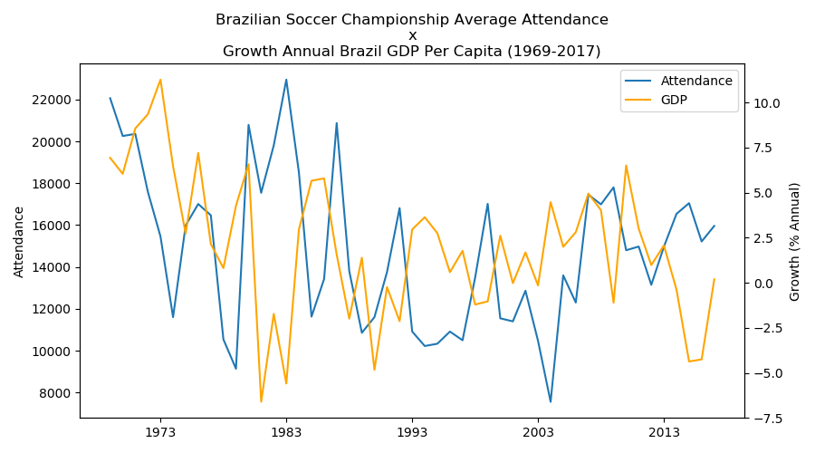
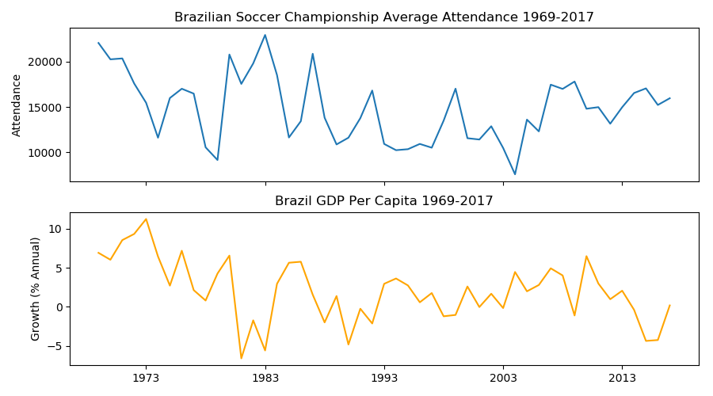

# Brazilian-Soccer-Championship-Average-Attendance-x-Growth-Annual-Brazil-GDP-Per-Capita-1969-2017-
Exercícios feito para conclusão do segundo curso da Especialização em Data Science pela University of Michigan - Applied Plotting, Charting &amp; Data Representation in Python. Onde cada um deveria escolher dois temas da sua preferência e que possivelmente possa ter alguma relação.
Para este trabalho eu escolhi dois temas que eu pensava que poderia ter uma grande relação entre si, eles foram: a média de publico no campeonato Brasileiro de Futebol e o crescimento anual do PIB.

Os dois data set podem ser obtido atráves desses dois links:
https://pt.wikipedia.org/wiki/P%C3%BAblicos_no_Campeonato_Brasileiro_de_Futebol#M%C3%A9dias_anuais_gerais_das_competi%C3%A7%C3%B5es

http://api.worldbank.org/v2/en/indicator/NY.GDP.MKTP.KD.ZG?downloadformat=csv

Os dados usados são do periodo de 1969 à 2017. Eu resolvi usar duas abordagem, uma de plotar as duas linhas em um mesmo gráfico, com dois eixo Y, um para cada onde cada representa: a média de público e o outro o crescimento anual do PIB do Brasil em porcentagem. A outra abordagem foi fazer 2 subplot, e dividir uma coluna em duas linhas, fazendo eles compartilhar o mesmo eixo X e um eixo Y para cada.
Os resultado podem ser visto a seguir:
<h3>Abordagem de 2 linhas em um gráfico</h3>
 
</img>

<h3>Abordagem com subplots</h3>
</img>

<h3>Conclusão</h3>
  Surpreendentemente o resultado foi ao contrário do que eu pensava, como observado nas imagens, a média de público no Campeonato Brasileiro tende a aumentar quando o crecismento do PIB está diminuindo como podemos ver entre o período de 1979 à 1985, e também ocorre o contrário quando o PIB está crescendo a média de público do Campeonato Brasileiro tende a diminuir como visto no período de 1993 à 1998.
  Esses dados me fez refletir e levantar algumas questões, como por exemplo:
  Será que isso ocorre pois os preços dos ingressos tende a seguir o PIB, que quando um diminui o outro também diminui, tornando isso um atrativo para as pessoa irem aos estádios?
  Ou por causa de estarmos em uma recessão(um período difícil para a maiora das pessoas) as pessoas tendem a procurar mais o lazer para dimuinir o estresse?
  Estas e outras questões são difícies de responder, muito por conta da falta de dados específicos a este tema e por conta de esse ser um tema que precisa de um estudo mais aprofundado do que este que eu fiz. A todo caso, foi uma experiência muito boa este segundo curso da especialização e creio que estou no caminho certo fazendo esse curso.
  Até o proxímo trabalho!
